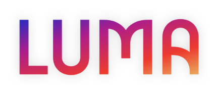

# LUMA Voice Assistant

<div align="center">
  
  <br>
  <strong>Your destination for accessibility</strong>
  <br><br>
  
  [](https://python.org)
  [](https://flask.palletsprojects.com)
  [](LICENSE)
  [](https://www.w3.org/WAI/WCAG21/quickref/)
</div>

## 🌟 Overview

LUMA is a comprehensive voice assistant web application specifically designed for visually impaired users. It combines cutting-edge AI technology with accessibility-first design to provide voice interaction, camera integration, OCR text reading, and intelligent question answering.

## ✨ Features

### **Advanced Voice Interface**
- **Multi-Engine Speech Recognition**: Google Speech API with fallback support
- **Natural Text-to-Speech**: High-quality voice synthesis with gTTS and pyttsx3
- **Wake Word Detection**: Hands-free "Hey Liya" activation
- **Voice Command Processing**: Natural language understanding

### **Dual Application Modes**
- **`app.py`**: Desktop version with IP camera support and local speech processing
- **`app_lite.py`**: Web-optimized version with browser-based camera and advanced AI

### **Intelligent OCR System**
- **Multi-Provider OCR**: OCR.space API + Tesseract fallback
- **Real-time Text Recognition**: Instant text detection from camera feeds
- **Smart Memory System**: RAG-based context retention for better responses
- **Voice-First Output**: Automatic text-to-speech conversion

### **AI-Powered Assistance**
- **Google Gemini Integration**: Advanced conversational AI
- **Contextual Understanding**: Remembers previous interactions
- **Accessibility-Focused Responses**: Optimized for visually impaired users
- **Fallback Support**: Works without internet connection

### **Accessibility-First Design**
- **PWA Support**: Install as native app with offline capabilities
- **High Contrast UI**: Optimized for low vision users
- **Keyboard Navigation**: Full accessibility compliance
- **Screen Reader Compatible**: ARIA labels and semantic HTML
- **Responsive Design**: Works on all devices

## 🚀 Quick Start

### Prerequisites
- Python 3.8+
- Microphone access
- Camera (webcam or smartphone)

### Installation

1. **Clone the repository**
   ```bash
   git clone <your-repo-url>
   cd WEB-APP
   ```

2. **Install dependencies**
   ```bash
   pip install -r requirements.txt
   ```

3. **Configure environment**
   ```bash
   cp .env.example .env
   ```
   
   Edit `.env` and add your API keys:
   ```env
   OCR_SPACE_API_KEY=your_api_key_here
   GEMINI_API_KEY=your_gemini_key_here
   ```

4. **Run the application**
   
   **Desktop Version (with IP camera support):**
   ```bash
   python app.py
   # Access at http://localhost:5000
   ```
   
   **Web Version (browser camera + advanced AI):**
   ```bash
   python app_lite.py
   # Access at http://localhost:5001
   ```

## 🎯 Usage Guide

### Voice Commands
- **"Hey Liya"** - Wake word activation
- **"Read text"** - OCR text recognition
- **"What do you see?"** - Image description
- **"Help me"** - Get assistance
- **Ask any question** - AI-powered responses

3. **Browser Camera**: Grant camera permissions for web version

## Architecture

### Application Structure
```
WEB APP/
├── app.py              # Desktop version with IP camera
├── app_lite.py         # Web version with advanced AI
├── requirements.txt    # Python dependencies
├── .env.example       # Environment template
├── Assets/            # Logo and branding
├── static/            # Web assets (PWA, icons)
└── templates/         # HTML templates
```

### API Endpoints

**Common Endpoints:**
- `GET /` - Main interface
- `POST /api/ask` - AI question processing
- `POST /api/speak` - Text-to-speech
- `POST /api/ocr` - OCR processing

**Desktop Version (`app.py`):**
- `POST /api/listen` - Voice input capture
- `POST /api/set_camera` - IP camera configuration
- `GET /video_feed` - Live camera stream

**Web Version (`app_lite.py`):**
- `GET /sw.js` - Service worker (PWA)
- `GET /manifest.webmanifest` - PWA manifest
- `POST /api/rag/clear` - Clear AI memory

## Configuration

### Environment Variables
```env
# OCR Configuration
OCR_SPACE_API_KEY=your_ocr_api_key

# AI Configuration  
GEMINI_API_KEY=your_gemini_api_key
GEMINI_MODEL_ID=gemini-2.0-flash
ANSWER_WORD_LIMIT=40

# Optional
HUGGINGFACE_API_TOKEN=your_hf_token
RAG_STORE_PATH=rag_store.json
```

## Development

### Tech Stack
- **Backend**: Flask, Python
- **Frontend**: HTML, CSS
- **AI/ML**: Google Gemini, Hugging Face
- **Speech**: Web Speech API, gTTS, pyttsx3
- **Vision**: OpenCV, OCR.space, Tesseract
- **PWA**: Service Worker, Web App Manifest

### Key Dependencies
```
flask==2.3.3
flask-cors==4.0.0
opencv-python==4.8.1.78
speechrecognition==3.10.0
pyttsx3==2.90
pillow==10.0.1
pytesseract==0.3.10
gtts==2.4.0
```

## Contributing

We welcome contributions that improve accessibility and user experience:

1. Fork the repository
2. Create a feature branch
3. Make your changes
4. Test with screen readers
5. Submit a pull request

### Accessibility Guidelines
- Follow WCAG 2.1 AA standards
- Test with keyboard navigation
- Verify screen reader compatibility
- Maintain high contrast ratios

## PWA Features

The web version (`app_lite.py`) includes:
- **Offline Support**: Service worker caching
- **Install Prompt**: Add to home screen
- **Native Feel**: Full-screen app experience
- **Background Sync**: Reliable functionality

## Troubleshooting

### Common Issues

**Camera Not Working:**
- Check browser permissions
- Verify network connectivity for IP cameras
- Try different camera apps

**Voice Recognition Issues:**
- Enable microphone permissions
- Check for background noise
- Verify internet connection

**OCR Problems:**
- Ensure good lighting
- Verify API keys in `.env`
- Check text clarity and size

## 📄 License

This project is licensed under the MIT License - see the [LICENSE](LICENSE) file for details.

## 🙏 Acknowledgments

- Built with accessibility in mind for the visually impaired community
- Powered by Google Gemini AI and OCR.space
- Inspired by the need for inclusive technology

---

<div align="center">
  <strong>Making technology accessible for everyone</strong><br>
  <em>LUMA - Your destination for accessibility</em>
</div>
